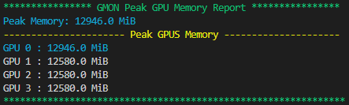

# gmon: GPU Memory Monitoring Tool

`gmon` is a lightweight, easy-to-use Python tool designed for monitoring GPU memory usage in real-time. It helps in tracking the peak GPU memory usage of scripts, particularly useful in optimizing and debugging machine learning and data processing applications.

## Installation

To install `gmon`, simply use pip to install directly from the GitHub repository:

```bash
pip install git+https://github.com/adamlouly/gmon.git
```

Ensure you have `nvidia-smi` installed on your system as `gmon` relies on it for fetching GPU memory usage data.

## Usage

Using `gmon` is straightforward. To monitor the GPU memory usage of your script, prefix your command with `gmon`. For example:

```bash
gmon python your_script.py
```

Replace `your_script.py` with the path to the Python script you want to monitor. `gmon` will run your script and display the peak GPU memory usage once the script completes.

Here's an example of what the output looks like:




## Features

- **Real-time Monitoring:** Continuously tracks GPU memory usage during the runtime of your script.
- **Peak Memory Reporting:** Identifies and reports the peak memory usage across all available GPUs.
- **Easy Integration:** Works seamlessly with any Python script without needing modifications to the script itself.

## Requirements

- NVIDIA GPU with the NVIDIA drivers installed.
- `nvidia-smi` command-line tool.

## License

`gmon` is open-sourced under the MIT License. See the [LICENSE](LICENSE) file for more details.

---